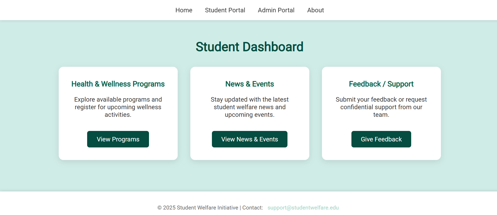
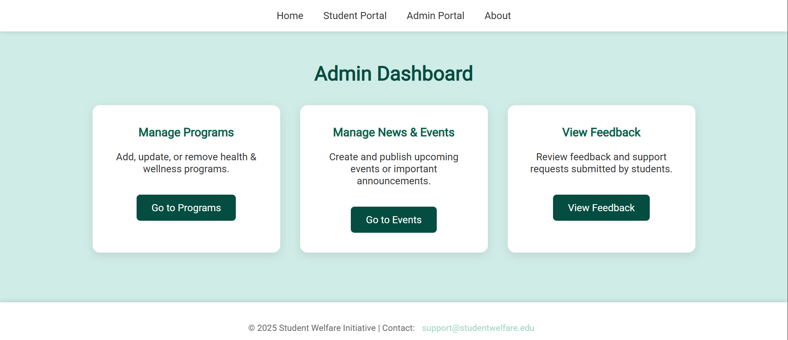

Student Health & Wellness Platform – Frontend

A student-centric digital platform to support well-being through an intuitive frontend interface for students, faculty, and admins.

🌟 Overview

The frontend provides a clean, responsive, and easy-to-use interface for students, faculty, and administrators. It is designed to display profiles, dashboards, and wellness-related information in an organized way.

🚀 Features (Frontend Only)

🎓 Student Profile – Personalized dashboard to view wellness resources.

🛠️ Admin Profile – Manage student and faculty data.

🎨 Responsive UI – Built with HTML, CSS, and JavaScript for smooth experience.

🖼️ Screenshots
🎓 Student Dashboard 
### 🎓 Student Dashboard

🛠️ Admin Dashboard
### 🎓 Student Dashboard

🏗️ Tech Stack (Frontend)

HTML5

CSS3

JavaScript (Vanilla JS)

📌 How to Run

Clone the repository:

git clone https://github.com/Harshi3107/student-health-wellness-platform.git
cd student-health-wellness-platform

Open index.html in your browser.

📈 Future Enhancements

Connect frontend to backend APIs for dynamic data.

Display survey results and analytics.

Add interactive charts for wellness tracking.

Integrate AI-driven wellness recommendations.

🤝 Contributing

Pull requests are welcome! For major changes, please open an issue first to discuss what you’d like to change.

📜 License

This project is licensed under the MIT License.